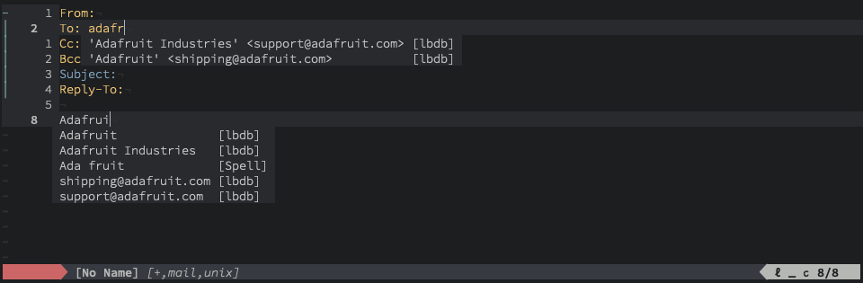

compe-lbdb
==========

lbdb completion source for [nvim-compe](https://github.com/hrsh7th/nvim-compe). Names, emails, and email header recipient formatted completions are provided contacts found in lbdb.



Installation
------------

Use your favorite plugin manager:

- [vim-plug](https://github.com/junegunn/vim-plug)
  ```vim
  Plug 'codybuell/compe-lbdb'
  ```
- [pathogen](https://github.com/tpope/vim-pathogen)
  ```bash
  git clone https://github.com/codybuell/compe-lbdb.git ~/.config/nvim/bundle/compe-lbdb
  ```
- native package manager
  ```bash
  git clone https://github.com/codybuell/compe-lbdb.git ~/.config/nvim/pack/bundle/opt/compe-lbdb
  ```
  ```vim
  packadd! compe-lbdb
  ```

Usage
-----
```lua
-- setup with defaults (markdown and mail file types, priority 100)
require('compe').setup({
  -- snip...
  source = {
    -- snip...
    lbdb = true,
    -- snip...
  }
})

-- or alternatively, enable with overrides
require('compe').setup({
  -- snip...
  source = {
    -- snip...
    lbdb = {
      priority = 80,
      filetypes = {'mail'},
      blacklist = {
        'cody@codybuell.com',
        '.*noreply.*',
      },
    },
    -- snip...
  }
})
```
_Note that if you are configuring your own blacklist it will not be picked up if compe is initialized in an after script._
